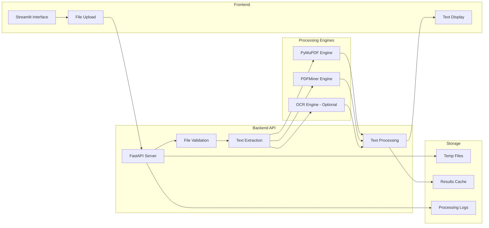

# 📄 Document Text Extractor Challenge

[]()
[]()
[]()
[]()

## 🎯 Overview

Build a comprehensive document processing application that allows users to upload PDF documents through an intuitive Streamlit interface. The FastAPI backend processes these uploads by extracting plain text, which is then displayed to users with enhanced formatting and metadata extraction capabilities.

## 🏗️ System Architecture



## 🎯 Requirements

### Core Functionality
- [ ] **PDF Upload**: Support multiple PDF file uploads via Streamlit interface
- [ ] **Text Extraction**: Extract plain text from PDF documents accurately
- [ ] **Real-time Processing**: Show extraction progress and results immediately
- [ ] **Error Handling**: Graceful handling of corrupted or unsupported files
- [ ] **File Validation**: Verify file types, sizes, and integrity
- [ ] **Text Display**: Present extracted text with proper formatting

### Technical Requirements
- [ ] **FastAPI Backend**: RESTful API with async file processing
- [ ] **Streamlit Frontend**: Intuitive, responsive user interface
- [ ] **Multiple Engines**: Support PyMuPDF and pdfminer.six for reliability
- [ ] **File Security**: Safe file handling and cleanup
- [ ] **Performance**: Efficient processing of large documents
- [ ] **Logging**: Comprehensive logging for debugging and monitoring

### Enhanced Features
- [ ] **Metadata Extraction**: Document properties, page count, creation date
- [ ] **Text Analysis**: Word count, language detection, reading time
- [ ] **Export Options**: Download extracted text as TXT, JSON, or formatted output
- [ ] **Batch Processing**: Process multiple files simultaneously
- [ ] **Text Search**: Search within extracted text
- [ ] **OCR Support**: Handle scanned PDFs with optical character recognition

## 📋 API Specification

### File Upload Endpoint
```http
POST /api/extract/upload
Content-Type: multipart/form-data

Form Data:
- file: PDF file (required)
- engine: "pymupdf"|"pdfminer"|"auto" (optional, default: "auto")
- include_metadata: boolean (optional, default: true)
- ocr_enabled: boolean (optional, default: false)

Response:
{
    "task_id": "uuid-string",
    "filename": "document.pdf",
    "file_size": 1024000,
    "status": "processing",
    "estimated_time": 30
}
```

### Get Extraction Status
```http
GET /api/extract/status/{task_id}

Response:
{
    "task_id": "uuid-string",
    "status": "completed|processing|failed",
    "progress": 85,
    "result": {
        "text": "Extracted text content...",
        "metadata": {
            "title": "Document Title",
            "author": "Author Name",
            "page_count": 10,
            "word_count": 2500,
            "creation_date": "2024-01-01T00:00:00Z",
            "language": "en"
        }
    },
    "error": null,
    "processing_time": 12.5
}
```

### Download Extracted Text
```http
GET /api/extract/download/{task_id}?format=txt|json|html

Response: File download or JSON with download URL
```

### Health Check
```http
GET /api/health

Response:
{
    "status": "healthy",
    "engines": {
        "pymupdf": "available",
        "pdfminer": "available",
        "ocr": "optional"
    },
    "version": "1.0.0"
}
```

## 🏗️ Project Structure

```
backend/document-text-extractor/
├── README.md                   # This file
├── requirements.txt            # Python dependencies
├── .env.example               # Environment variables template
├── app/
│   ├── __init__.py
│   ├── main.py                # FastAPI application entry point
│   ├── config.py              # Configuration settings
│   ├── models/
│   │   ├── __init__.py
│   │   ├── extraction.py      # Data models for extraction
│   │   └── response.py        # API response models
│   ├── api/
│   │   ├── __init__.py
│   │   ├── extraction.py      # Extraction API endpoints
│   │   └── health.py          # Health check endpoints
│   ├── services/
│   │   ├── __init__.py
│   │   ├── pdf_extractor.py   # Core extraction logic
│   │   ├── text_processor.py  # Text processing utilities
│   │   ├── metadata_extractor.py # Metadata extraction
│   │   └── file_manager.py    # File handling and cleanup
│   ├── engines/
│   │   ├── __init__.py
│   │   ├── pymupdf_engine.py  # PyMuPDF implementation
│   │   ├── pdfminer_engine.py # PDFMiner implementation
│   │   └── ocr_engine.py      # OCR implementation (optional)
│   └── utils/
│       ├── __init__.py
│       ├── validators.py      # File validation utilities
│       ├── logging_config.py  # Logging configuration
│       └── exceptions.py      # Custom exceptions
├── streamlit_app.py           # Frontend application
├── tests/
│   ├── __init__.py
│   ├── test_api.py            # API endpoint tests
│   ├── test_extractors.py     # Extraction engine tests
│   ├── test_processors.py     # Text processing tests
│   └── fixtures/
│       ├── sample.pdf         # Test PDF files
│       └── corrupted.pdf      # Test edge cases
├── static/
│   ├── css/
│   │   └── streamlit_style.css # Custom styling
│   └── images/
│       └── logo.png           # Application logo
└── docs/
    ├── api_reference.md       # API documentation
    ├── deployment.md          # Deployment guide
    └── troubleshooting.md     # Common issues and solutions
```

## 🚀 Getting Started

### Prerequisites
```bash
# System requirements
Python 3.8+
pip or conda package manager

# Optional (for OCR support)
Tesseract OCR engine
```

### Installation

1. **Clone and Setup**
```bash
git clone <repository-url>
cd backend/document-text-extractor
cp .env.example .env
```

2. **Create Virtual Environment**
```bash
python -m venv venv
source venv/bin/activate  # On Windows: venv\Scripts\activate
```

3. **Install Dependencies**
```bash
pip install -r requirements.txt
```

4. **Optional: Install OCR Support**
```bash
# Ubuntu/Debian
sudo apt-get install tesseract-ocr tesseract-ocr-eng

# macOS
brew install tesseract

# Additional language packs
sudo apt-get install tesseract-ocr-fra tesseract-ocr-deu  # French, German
```

### Running the Application

1. **Start the FastAPI Server**
```bash
uvicorn app.main:app --reload --port 8000
```

2. **Start the Streamlit Interface** (in another terminal)
```bash
streamlit run streamlit_app.py --server.port 8501
```

3. **Access the Application**
- Streamlit UI: http://localhost:8501
- FastAPI Docs: http://localhost:8000/docs
- Health Check: http://localhost:8000/api/health

## 🖥️ Streamlit Interface Features

### Main Interface
- **Drag & Drop Upload**: Intuitive file upload with progress indicators
- **Multiple File Support**: Process several PDFs simultaneously
- **Engine Selection**: Choose extraction engine or let system auto-select
- **Real-time Progress**: Live updates during processing
- **Results Display**: Formatted text output with syntax highlighting

### Text Analysis Panel
- **Document Metadata**: File properties and statistics
- **Text Statistics**: Word count, character count, reading time
- **Language Detection**: Automatic language identification
- **Search Functionality**: Find and highlight text within results

### Export Options
- **Plain Text**: Download as .txt file
- **Structured JSON**: Metadata and text in JSON format
- **HTML Report**: Formatted HTML with styling
- **PDF Summary**: Generate processing report

## 🧪 Testing

### Running Tests
```bash
# All tests
pytest tests/ -v

# Specific test categories
pytest tests/test_api.py -v          # API tests
pytest tests/test_extractors.py -v   # Engine tests
pytest tests/test_processors.py -v   # Processing tests

# Coverage report
pytest tests/ --cov=app --cov-report=html
```

### Test Scenarios

#### File Validation Tests
- [ ] Valid PDF files (various sizes and formats)
- [ ] Invalid file types (non-PDF files)
- [ ] Corrupted PDF files
- [ ] Empty files
- [ ] Oversized files
- [ ] Password-protected PDFs

#### Extraction Engine Tests
- [ ] Text-based PDFs (PyMuPDF vs PDFMiner comparison)
- [ ] Image-based PDFs (OCR functionality)
- [ ] Complex layouts (tables, columns, footnotes)
- [ ] Non-English text (Unicode support)
- [ ] Mathematical formulas and special characters

#### Performance Tests
- [ ] Large file processing (>100MB)
- [ ] Concurrent uploads
- [ ] Memory usage monitoring
- [ ] Processing time benchmarks

## 📊 Streamlit Dashboard

### Upload Section
```python
# Example Streamlit interface structure
uploaded_files = st.file_uploader(
    "Choose PDF files",
    type=['pdf'],
    accept_multiple_files=True,
    help="Upload one or more PDF documents for text extraction"
)

# Processing options
col1, col2, col3 = st.columns(3)
with col1:
    engine = st.selectbox("Extraction Engine", ["auto", "pymupdf", "pdfminer"])
with col2:
    include_metadata = st.checkbox("Include Metadata", value=True)
with col3:
    ocr_enabled = st.checkbox("Enable OCR", value=False)
```

### Results Display
```python
# Results presentation
if extraction_results:
    # Tabs for different views
    tab1, tab2, tab3 = st.tabs(["Extracted Text", "Metadata", "Analytics"])
    
    with tab1:
        st.text_area("Extracted Text", value=results['text'], height=400)
        st.download_button("Download Text", data=results['text'])
    
    with tab2:
        st.json(results['metadata'])
    
    with tab3:
        # Text analytics and statistics
        display_text_analytics(results)
```

## 🔧 Configuration

### Environment Variables
```bash
# Application Settings
APP_NAME="Document Text Extractor"
APP_VERSION="1.0.0"
DEBUG=false

# API Configuration
API_HOST=0.0.0.0
API_PORT=8000
MAX_UPLOAD_SIZE=50MB
UPLOAD_TIMEOUT=300

# Processing Configuration
DEFAULT_ENGINE=auto
OCR_ENABLED=false
OCR_LANGUAGE=eng
CLEANUP_INTERVAL=3600

# Security
ALLOWED_EXTENSIONS=pdf
MAX_FILE_SIZE=52428800  # 50MB in bytes
RATE_LIMIT_REQUESTS=100
RATE_LIMIT_WINDOW=3600

# Logging
LOG_LEVEL=INFO
LOG_FILE=logs/app.log
LOG_ROTATION=midnight
```

## 🏆 Evaluation Criteria

| Criterion | Weight | Description |
|-----------|---------|-------------|
| **Functionality** | 25% | Accurate text extraction, file handling |
| **User Experience** | 20% | Intuitive interface, responsive design |
| **Code Quality** | 20% | Clean architecture, maintainable code |
| **Error Handling** | 15% | Graceful error handling, user feedback |
| **Performance** | 10% | Processing speed, memory efficiency |
| **Documentation** | 10% | README quality, code comments |

## 💡 Implementation Tips

### Text Extraction
- **Engine Selection**: PyMuPDF for speed, PDFMiner for accuracy
- **Fallback Strategy**: Implement engine fallback for failed extractions
- **Text Cleaning**: Remove extra whitespace, fix encoding issues
- **Layout Preservation**: Maintain paragraph structure when possible

### File Handling
- **Temporary Storage**: Clean up uploaded files after processing
- **Memory Management**: Stream large files instead of loading into memory
- **Validation**: Check file headers, not just extensions
- **Security**: Sanitize filenames and prevent path traversal

### Performance Optimization
- **Async Processing**: Use background tasks for large files
- **Caching**: Cache extraction results for repeated requests
- **Compression**: Compress results for faster transmission
- **Progress Tracking**: Provide real-time progress updates

## 🔗 Advanced Features

### OCR Integration
```python
# Example OCR configuration
{
    "enabled": true,
    "engine": "tesseract",
    "languages": ["eng", "fra", "deu"],
    "dpi": 300,
    "preprocessing": {
        "denoise": true,
        "deskew": true,
        "enhance_contrast": true
    }
}
```

### Batch Processing
```python
# Process multiple files
{
    "batch_id": "uuid-string",
    "files": [
        {"filename": "doc1.pdf", "task_id": "task-1"},
        {"filename": "doc2.pdf", "task_id": "task-2"}
    ],
    "batch_status": "processing",
    "completed_count": 1,
    "total_count": 2
}
```

## 📚 Resources

- [PyMuPDF Documentation](https://pymupdf.readthedocs.io/)
- [PDFMiner Documentation](https://pdfminersix.readthedocs.io/)
- [FastAPI File Uploads](https://fastapi.tiangolo.com/tutorial/request-files/)
- [Streamlit File Upload](https://docs.streamlit.io/library/api-reference/widgets/st.file_uploader)
- [Tesseract OCR](https://tesseract-ocr.github.io/)

---

<div align="center">
  <strong>Extract knowledge from documents! 📄</strong><br>
  <em>Transform PDFs into actionable text with precision and speed.</em>
</div>